---

## `$ whoami`

I build things that run on hardware I own. Most of my work orbits a home-automation and
self-hosting stack — a Proxmox host, a Raspberry Pi doing routing and DNS, a fleet of ESPHome
devices — plus the tools I needed along the way and couldn't find anywhere.

A few of those turned into protocol reverse-engineering projects. B.Tech CSE at Lovely
Professional University. I care about systems that keep running when nobody is watching them.

---

## `$ git log --author=Aryan795 --merged`

Contributions to **[Suwayomi-WebUI](https://github.com/Suwayomi/Suwayomi-WebUI)**, the web client
for a self-hosted manga server:

| PR | Change | State |
|---|---|---|
| [#1159](https://github.com/Suwayomi/Suwayomi-WebUI/pull/1159) | Fuzzy search across the library |  |
| [#1160](https://github.com/Suwayomi/Suwayomi-WebUI/pull/1160) | Autocomplete in the search bar |  |
| [#1161](https://github.com/Suwayomi/Suwayomi-WebUI/pull/1161) | Remembered search history |  |

---

## `$ ls -la ~/projects`

<table>
<tr>
<td width="50%" valign="top">

### [warp-local-adapter](https://github.com/Aryan795/warp-local-adapter)

Warp terminal's AI agent loop runs on Warp's servers, so the app refuses `localhost`. This
impersonates that server locally and forwards to any OpenAI-compatible endpoint. Wire protocol
reverse-engineered from scratch against a patched client.

`protobuf` · `axum` · `reverse engineering`

</td>
<td width="50%" valign="top">

### [jarvis](https://github.com/Aryan795/jarvis)

Offline-first voice assistant for Home Assistant. OpenWakeWord and Piper TTS on a Raspberry Pi,
Faster-Whisper STT behind FastAPI. A scored intent router over two FAISS indexes and a regex rule
engine keeps ~85% of fallbacks local on Gemma 3:4B at 200–400 ms, with only ~5% escalating to a
cloud API.

`Python` · `FastAPI` · `FAISS` · `Ollama` · `SQLite`

</td>
</tr>
<tr>
<td width="50%" valign="top">

### [webapp-dash](https://github.com/Aryan795/webapp-dash)

Wall-tablet dashboard for Home Assistant. The HA token never reaches the tablet — a Node proxy
holds it and fans state out over a tokenless socket, behind a server-side service allowlist.
Built to run unattended for months.

`React` · `TypeScript` · `Node` · `Kotlin`

</td>
<td width="50%" valign="top">

### [bench](https://github.com/Aryan795/bench)

Self-hosted site for projects and writing, with an admin panel. For people who make things in
more than one discipline and want a single coherent index. One `docker compose up`.

`Node` · `Express` · `MongoDB`

</td>
</tr>
<tr>
<td width="50%" valign="top">

### [Ha_fan_integration](https://github.com/Aryan795/Ha_fan_integration)

Local Home Assistant integration for Atomberg fans over LAN UDP — fan, light, sleep mode and
timer entities, with no cloud round-trip.

`Python` · `HACS`

</td>
<td width="50%" valign="top">

### [Car_Counter](https://github.com/Aryan795/Car_Counter)

Real-time vehicle detection and counting from video.

`Python` · `OpenCV` · `YOLOv8`

</td>
</tr>
</table>

---

## `$ systemctl status homelab`

Two long-running builds that don't live in a repo, and the infrastructure under everything above.

**Self-hosted infrastructure platform** — a virtualization stack on Proxmox with a TrueNAS storage
VM exporting NFS to LXC containers and Docker Compose services, Jellyfin and Grafana included.
Services are published through a Caddy reverse proxy with automatic TLS over a Cloudflare Tunnel,
so there is zero inbound port forwarding, plus a Tailscale mesh and a self-hosted exit node for
remote access. Network-wide DNS filtering runs on AdGuard Home behind a custom OpenWrt router on a
Raspberry Pi 3B+.

**Smart switch retrofit** — custom circuits that convert manual wall switches into smart switches
using ESP microcontrollers and relays, keeping full manual operation even when the controller or
network is down. Integrated into Home Assistant over ESPHome and MQTT with real-time state sync
between physical presses and app actions. Two years of daily use.

<b>What's actually running</b>

 

| Layer | Detail |
|---|---|
| **Compute** | Proxmox on an i5 host · TrueNAS with a 3×500 GB RAIDZ1 pool · LXC + Docker Compose |
| **Network** | OpenWrt on a Raspberry Pi 3B+ · Caddy with automatic TLS · Cloudflare Tunnel · Tailscale mesh and exit node · AdGuard Home |
| **Automation** | Home Assistant OS on a Pi 4 · ~22 ESPHome devices · 79 automations · MQTT and Zigbee |
| **Media & making** | Jellyfin · Suwayomi manga server · Anycubic Kobra 2 Neo on Klipper |

---

## `$ cat /etc/stack`

---

## `$ cat stats.json`

> Generated inside this repo by a [GitHub Action](.github/workflows/stats.yml) rather than a
> third-party service, so it can't break when someone else's free tier runs out.

---

## `$ cat credentials.txt`

**Education** — B.Tech, Computer Science and Engineering · Lovely Professional University,
Phagwara · 2024–2028 · **CGPA 9.50**

**Certificates** — Oracle Agentic AI Certified Foundations Associate (2026) · Database Management
Systems, Infosys Springboard (2026) · Programming Using C++, Infosys Springboard (2025) · Data
Structures & Algorithms, CipherSchools (2026)

**Problem solving** — 200+ LeetCode problems solved, primarily in C++ (116 medium, 38 hard),
74-day maximum daily streak and the 100 Days Badge 2025

---

## `$ ./contributions --animate`

<picture>
  <source media="(prefers-color-scheme: dark)" srcset="https://raw.githubusercontent.com/Aryan795/Aryan795/output/snake-dark.svg" />
  <source media="(prefers-color-scheme: light)" srcset="https://raw.githubusercontent.com/Aryan795/Aryan795/output/snake.svg" />
  
</picture>

